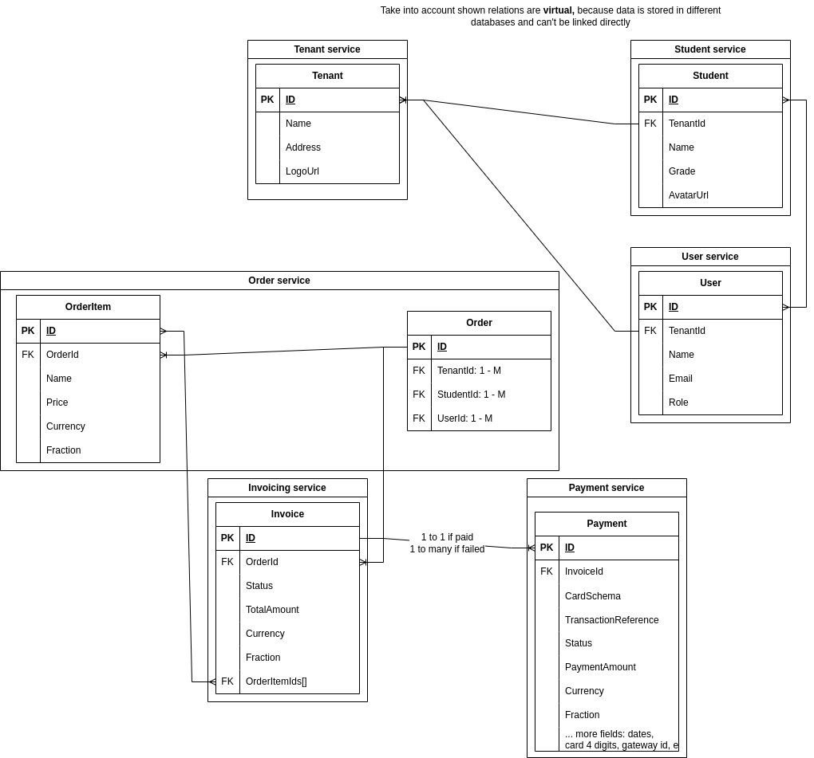

# Payment Processing System

This project is a mocked "invoice and payment management system using microservices architecture". The system supports functionalities such as handling orders, generating invoices, processing payments, and retrieving receipts.

## Table of Contents

1. [Local Setup Guide](#local-setup-guide)
2. [API Reference](#api-reference)
    - [Swagger UI](#swagger-ui)
    - [Postman Collection](#postman-collection)
    - [Endpoint Descriptions](#endpoint-descriptions)
3. [High-Level Design](#high-level-design)
    - [System Architecture](#system-architecture)
    - [ER Diagram](#er-diagram)
4. [In-scope user journey:](#in-scope-user-journey)

---

## Local Setup Guide

### Prerequisites
- **Java 17** or later
- **Maven** or **Gradle**
- **Postman** (optional, for API testing)

### Steps to Run Locally
1. Clone the repository `git clone git@github.com:dadonnik/order-management-system.git`
2. Navigate to the project root directory
3. Run the following command to build the project:
    ```shell
    mvn clean install
    ```
4. Run the following command to start the application:
    ```shell
    mvn spring-boot:run
    ```
5. The application will start on `http://localhost:8080`

## API Reference

### Swagger UI
The API documentation is available at `http://localhost:8080/swagger-ui.html`

### Postman Collection

<details>
  <summary>JSON inside</summary>

    Copy and insert to your Postman
```json
{
  "info": {
    "_postman_id": "55250833-02bb-4cb2-90ac-6980ceb8e05f",
    "name": "oms",
    "schema": "https://schema.getpostman.com/json/collection/v2.1.0/collection.json",
    "_exporter_id": "15594057"
  },
  "item": [
    {
      "name": "api/payment",
      "request": {
        "method": "POST",
        "header": [],
        "body": {
          "mode": "formdata",
          "formdata": [
            {
              "key": "invoiceId",
              "value": "1",
              "type": "text"
            }
          ]
        },
        "url": {
          "raw": "localhost:8080/api/payments",
          "host": [
            "localhost"
          ],
          "port": "8080",
          "path": [
            "api",
            "payments"
          ]
        }
      },
      "response": []
    },
    {
      "name": "api/payment/process",
      "request": {
        "method": "POST",
        "header": [],
        "body": {
          "mode": "formdata",
          "formdata": [
            {
              "key": "paymentId",
              "value": "1",
              "type": "text"
            }
          ]
        },
        "url": {
          "raw": "localhost:8080/api/payments/process",
          "host": [
            "localhost"
          ],
          "port": "8080",
          "path": [
            "api",
            "payments",
            "process"
          ]
        }
      },
      "response": []
    },
    {
      "name": "api/invoices",
      "request": {
        "method": "GET",
        "header": [],
        "url": {
          "raw": "localhost:8080/api/invoices/3",
          "host": [
            "localhost"
          ],
          "port": "8080",
          "path": [
            "api",
            "invoices",
            "3"
          ]
        }
      },
      "response": []
    },
    {
      "name": "api/invoices",
      "request": {
        "method": "POST",
        "header": [],
        "body": {
          "mode": "raw",
          "raw": "{\n    \"orderId\": 1,\n    \"selectedItems\": [1,2,3]\n}",
          "options": {
            "raw": {
              "language": "json"
            }
          }
        },
        "url": {
          "raw": "localhost:8080/api/invoices",
          "host": [
            "localhost"
          ],
          "port": "8080",
          "path": [
            "api",
            "invoices"
          ]
        }
      },
      "response": []
    },
    {
      "name": "api/students",
      "request": {
        "method": "GET",
        "header": [],
        "url": {
          "raw": "localhost:8080/api/invoices?invoiceId=1",
          "host": [
            "localhost"
          ],
          "port": "8080",
          "path": [
            "api",
            "invoices"
          ],
          "query": [
            {
              "key": "invoiceId",
              "value": "1"
            }
          ]
        }
      },
      "response": []
    },
    {
      "name": "api/orders",
      "request": {
        "method": "GET",
        "header": [],
        "url": {
          "raw": "localhost:8080/api/orders/1",
          "host": [
            "localhost"
          ],
          "port": "8080",
          "path": [
            "api",
            "orders",
            "1"
          ]
        }
      },
      "response": []
    },
    {
      "name": "api/receipts",
      "request": {
        "method": "GET",
        "header": [],
        "url": {
          "raw": "localhost:8080/api/receipts?orderId=1",
          "host": [
            "localhost"
          ],
          "port": "8080",
          "path": [
            "api",
            "receipts"
          ],
          "query": [
            {
              "key": "orderId",
              "value": "1"
            }
          ]
        }
      },
      "response": []
    }
  ]
}
```

</details>

### DB explorer
H2 console: `http://localhost:8080/h2-console`

### Endpoint Descriptions

| HTTP Method 	| Endpoint             	  | Params 	                                    | Description                                                                                                                                          	           |
|-------------	|-------------------------|---------------------------------------------|------------------------------------------------------------------------------------------------------------------------------------------------------------------|
| GET         	| /api/orders/{id}     	  | id     	                                    | Get order info and item breakdown by order id                                                                                                        	           |
| POST        	| /api/invoices        	  | orderId: 1,<br/>selectedItems: [1,2,3]    	 | Create invoice based on selected order items.  If customer selects items which are already assigned to another not-cancelled invoice, request will be rejected 	 |
| POST        	| /api/payments        	  | invoiceId: 1     	                          | Initializes the payment based on invoiceId. Idempotent by invoiceId + status: PENDING/PAID                                                           	           |
| POST        	| /api/payments/process 	 | paymentId: 1     	                          | Simulating webhook call from payment gateway about payment result. Idempotent if status not PENDING                                                  	           |

## High-Level Design


### ER Diagram


### Out of scope systems:
- **User Management System**: Manages user accounts, roles, and permissions
- **Tenant Management System**: Manages tenant information and configurations. Tenant in this context is a school or university.
- **Student Management System**: Manages student information, grades, relations with parents
- **Order Management System**: Manages orders and items

### In-scope systems:
- **Invoicing System**: Manages invoice creation based on orders and items
- **Payment Processing System**: Manages payment initiation and processing
- **Receipt Management System**: Responsible for data aggregation and storing receipts
- **Payment Provider**: Adapter factory to communicate with external payment gateways like Stripe, Checkout, PayPal

### System Architecture

Please notice, it's a simulation of a microservice architecture. Every service is a separate package in the same project. Codebase of every system is build according to 3-layer architecture.
1. Presentation Layer: The REST Controller, handles HTTP requests, converts them into a form suitable for the business layer, and returns the appropriate HTTP response. 
2. Service Layer: Contains business logic. It calls the repository to retrieve and process data, and orchestrates the application's functionality. 
3. Persistence Layer: Repository interacts with the database using the entities. It is responsible for retrieving and persisting data to and from the database.

Some limitations of this simulation:
- Single H2 in memory database is used for all services.
- To simulate multiple databases, each service has its own table. No relations between tables.
- Each service is a java package with its own controller, service, repository, and model classes.
- To simulate inter-service communication, each service has a REST API to communicate with other services.
- There is no in-code reference to other services. All communication is done via REST API. Only interfaces are shared between services.
- Example of shared interfaces `imports in InvoiceServiceImpl.java`:
  ```java
    package com.example.invoicing_system;
    import org.springframework.stereotype.Service;
    import out_of_scope_services.order_management_system.Order;
    import shared_lib.api_clients.OrderServiceClient;
    import shared_lib.models.Price;
    
    import java.util.List;
    import java.util.Set;
    import java.util.stream.Collectors;
  ```
  `order_management_system.Order` and `shared_lib.models.Price;` are shared interfaces.
- For simplicity DTOs weren't used. All services use the same model classes.

## In-scope user journey:
1. **Order Management System** creates an order with items for particular Parent related to particular student in particular school. *Out of scope, but it's entrypoint of payment processing flow*
2. **Invoicing System** creates an invoice based on the order. Invoice contains selected items from the order. Invoice can have 3 statuses: `PENDING`, `PAID`, `CANCELLED`. If customer selects items which are already assigned to another not-cancelled invoice, request will be rejected. 
For e.g. customer created invoice with items 1,2,3. Then customer tries to create another invoice with items 3,4. Request will be rejected, because item `3` is already assigned to another invoice.
3. **Payment Processing System** initializes the payment based on invoiceId. Payment can have 3 statuses: `PENDING`, `PAID`, `FAILED`. Payment is idempotent by invoiceId + status: `PENDING`/`PAID`.
If Payment is in `PENDING` or `PAID` status, further requests with the same invoiceId will not create new payments. However, if payment is in `FAILED` status, new payment can be created.
4. When payment is initialized, **Payment Provider** is called to process the payment. Payment provider is a factory to communicate with external payment gateways like Stripe, Checkout, PayPal.
5. **Payment Processing System** Simulates a webhook call from **Payment Provider** about payment result. (In this example we are calling this endpoint manually passing paymentId)
6. **Payment Processing System** Creates a PaymentProcessed Event. (Used spring-boot observer pattern to simulate event-driven architecture)
7. **Invoicing System** listens to PaymentProcessed Event and updates invoice status to `PAID`.
8. **Receipt Management System** listens to PaymentProcessed Event and creates a receipt based on payment information.
9. **Receipt Management System** stores the receipt in the database. User can query it by orderId, invoiceId or receiptId.